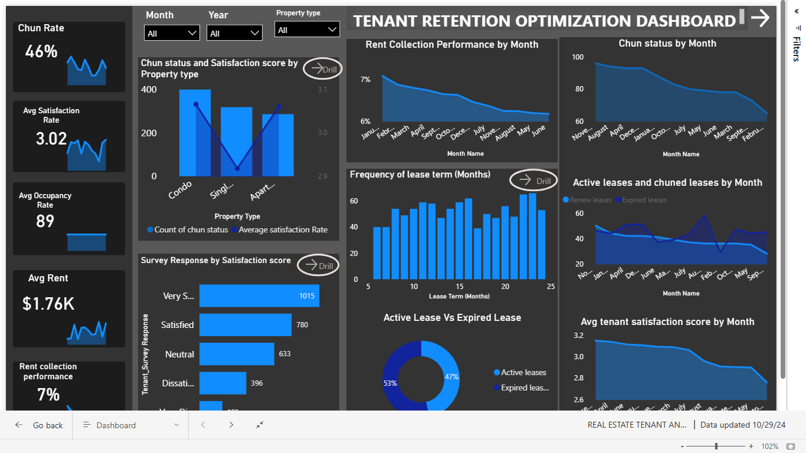
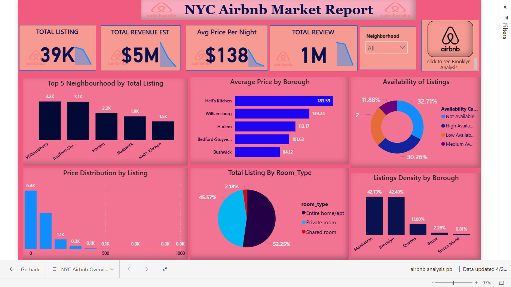
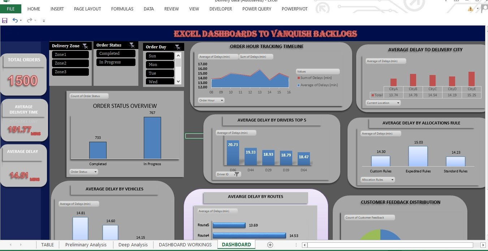
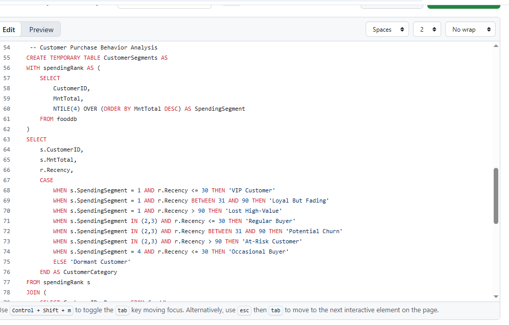
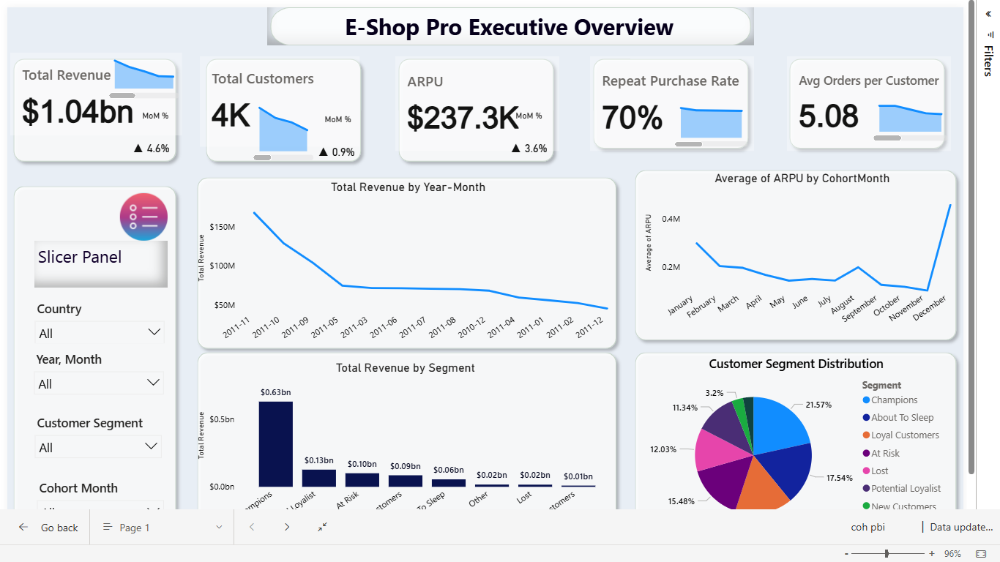

# 👋 Hi, I’m Ajayi Oluwaseyi
### Data Analyst | BI Specialist | SQL | Power BI | Excel | Python

I’m a Data Analyst transitioning into Data Science, with a background in **Psychology** and a passion for uncovering insights through data.

With a BSc in Psychology, I bring a human-centered approach to data interpretation — blending behavioral understanding with analytical thinking. My toolkit includes **Power BI, SQL, Excel, and Python**, which I use to turn raw data into strategic, actionable insights.

I’m currently expanding my expertise into machine learning and advanced analytics. Beyond tools and tech, I value clarity and storytelling — making complex data understandable and impactful.

---

## 🧩 Featured Projects

---

### 🏢 Tenant Retention Optimization | Power BI

An interactive **Power BI dashboard** for *HomeVibe Properties* that analyzes tenant churn, lease renewals, and satisfaction metrics to improve customer retention.

**Highlights:**
- 4-page dashboard covering churn, rent renewal, and satisfaction
- Advanced DAX for renewal rate and satisfaction segmentation
- Action-driven insights for management decision-making  

📂 [View on GitHub →](https://github.com/Psychizzy/RealEstate-Tenant-Retention-Optimization)

---

### 🏨 Airbnb NYC Market Analysis | Power BI

Analyzed **Airbnb listings across New York City**, visualizing key insights on pricing, host performance, availability, and neighborhood trends.

**Highlights:**
- Pricing distribution across boroughs  
- Occupancy rates and host rankings  
- Seasonality & dynamic slicers for neighborhood-level insights  

📂 [View on GitHub →](https://github.com/Psychizzy/Airbnb-NYC-Data-Analysis-)

---

### 📦 Excel Backlog Dashboard | Excel

A clean and functional **Excel dashboard** built to track order fulfillment and delivery efficiency, enabling management to identify bottlenecks and improve operations.

**Highlights:**
- Tracks order volume, driver performance, and delivery backlog  
- Includes KPI panels and trend visualizations  
- Automated with formulas and PivotTables  

📂 [View on GitHub →](https://github.com/Psychizzy/EXCEL-BACKLOGS-ANALYSIS)

---

### 🧮 Customer Analytics (SQL)

SQL-based **Customer Analytics Project** exploring segmentation, churn, and revenue growth through customer-level transaction data.

**Highlights:**
- Retention and cohort segmentation  
- Revenue and customer churn queries  
- Delivered insights for marketing & customer success teams  

📂 [View on GitHub →](https://github.com/Psychizzy/Customer-Analytics-SQL-Project)

---

### 📈 Customer Cohort & Retention Analysis | Power BI

A data storytelling dashboard that explores **Cohort Retention, RFM Segmentation, and Lifetime Value** to visualize customer behavior and engagement trends.

**Highlights:**
- Interactive retention heatmaps and cohort tables  
- RFM-based segmentation and KPI cards  
- Executive summary for business stakeholders  

📂 [View on GitHub →](https://github.com/Psychizzy/customer-cohort-retention-powerbi)

---

## ⚙️ Skills & Tools

**Languages:** | SQL | Python  
**Visualization:** | Power BI | Excel | Tableau  
**Database:** | MySQL | PostgreSQL  
**Analytics:** | DAX | Pivot Tables | ETL | Data Cleaning | RFM | Cohort Analysis  
**Soft Skills:** | Storytelling | Presentation | Problem Solving  

---

## 💼 Services I Offer
- Data Cleaning & Transformation (ETL)
- Dashboard Design & Development (Power BI, Excel)
- SQL Data Analysis & Reporting
- Data Storytelling & Business Insights
- KPI Tracking & Executive Reporting

---

## 📬 Contact
📧 [Email me](mailto:oluwaseyi1414@gmail.com)  
🔗 [LinkedIn](https://www.linkedin.com/in/ajayi-oluwaseyi-865a35248)  
🐦 [Twitter](https://twitter.com/Psychizzy1414)  
📞 +2349035283723

---

> 💬 “Turning data into actionable insights — one dashboard at a time.”
